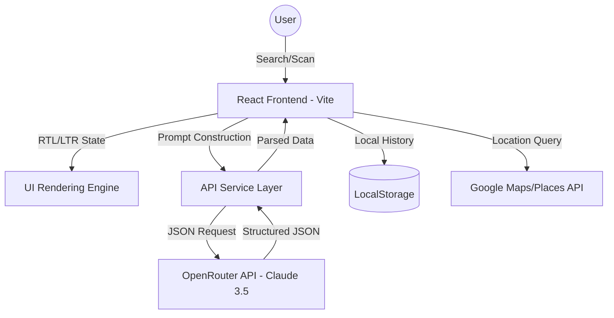

# MediFinder AI - Project Documentation

## 📄 Project Overview
**Team Name**: UNKNOWN  
**Team Lead Name**: M. Majid Khan  
**Project Name**: MediFinder AI  

---

## 1. Problem Statement
In the modern healthcare landscape, patients often struggle with:
- **Information Fragmentation**: Medical data (uses, side effects, active salts) is spread across multiple complex databases.
- **Accessibility Barriers**: Non-medical professionals find pharmaceutical terminology difficult to grasp.
- **Language Gaps**: Most medical platforms are English-only, leaving a massive Urdu-speaking population in Pakistan without reliable tools.
- **Handwriting Issues**: Deciphering doctor prescriptions is a common and dangerous challenge.
- **Price & Availability**: Finding affordable alternatives (generics) and nearby pharmacies is a manual, tedious process.

**MediFinder AI** solves these by providing a unified, bilingual (English/Urdu) AI assistant that translates complex medical data into actionable insights, scans prescriptions, and identifies nearby healthcare providers.

---

## 2. Frontend Details
- **Framework**: React 18 with Vite (Modern SPA Architecture).
- **Styling**: Vanilla CSS3 with a custom-built Design System (tokens for colors, typography, and glassmorphism).
- **Architecture**: Modular Component-based design with React Context for language and state management.
- **Responsiveness**: Fully responsive layout with a custom mobile menu overlay and RTL (Right-to-Left) support for Urdu.
- **Performance**: Optimized build using Vite, ensuring blazingly fast load times and smooth animations (typewriter effects, fade-ins).

---

## 3. AI Integration (System & Prompting)
MediFinder AI utilizes the **OpenRouter API** to access state-of-the-art LLMs (Claude 3.5 Sonnet). Our integration covers:
1. **Intelligent Search**: A sophisticated system prompt enforces structured JSON output, ensuring consistent data for 12+ fields (uses, salts, manufacturer, etc.).
2. **Prescription Vision**: Leverages multi-modal capabilities to scan handwritten prescriptions, extract medicine names, and provide instant dosage summaries.
3. **Safety Interaction Engine**: A specialized logic gate that compares two medications for chemical contraindications and returns a severity rating (Mild/Severe).
4. **Bilingual Engine**: Dynamically appends translation instructions to the system prompt based on the user's selected language (`en` or `ur`), ensuring 100% accurate medical Urdu.
5. **Contextual Chatbot**: A persistent "MediBot" that maintains conversation context for follow-up medical queries.

---

## 4. System Design Diagram
*The system follows a modern Serverless/Stateless architecture:*

---

## 5. Links
- **GitHub Repository**: [GitHub Link Placeholder]
- **Live Demo (Vercel)**: [Vercel Link Placeholder]

---

**Submitted by**: Shayan Abbas (Team Lead)  
**Organization**: GDGoC / Algoligence Project Submission
